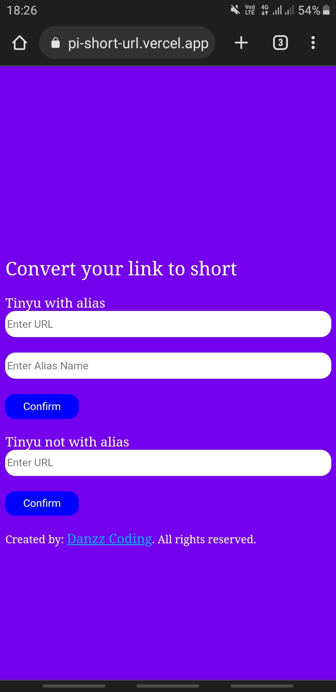

## Examples

<a href="https://api-short-url.danzzcoding.repl.co/">api-short-url.danzzcoding.repl.co/</a>

## Instalasi
## For termux
```
> apt update && apt upgrade
> pkg install nodejs
> pkg install git
> git clone https://github.com/Danzzxcodes/api-short-url
> cd api-short-url
> npm start
```
Server run on https://localhost:3000
